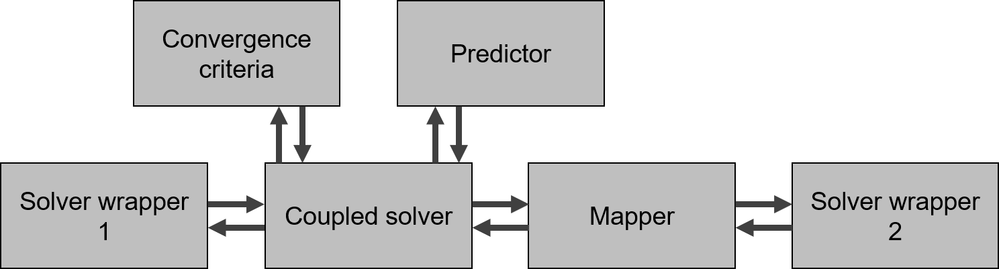

# Coupling components

The coupling components are the basic building blocks of the CoCoNuT coupling tool.
There are five types: 
* `convergence_criteria` which determine when the calculation in a time step has converged
* `coupled_solvers` (completed by `models`) which perform the actual coupling, implementing a coupling algorithm
* `mappers` which map from one interface discretization to another
* `predictors` which provide an initial guess at the start of a new time step
* `solver_wrappers` which provide communication which the actual solvers

The idea behind these components is modularity. For example, changing a `solver_wrapper` or creating a new one can be done wihtout having to adapt any other components.
This allows for high degree of flexibility, a short learning curve and a limited development effort.
Moreover, components can be used multiple times without the need for copying code.
Detailed information on these components can be found in the specific documentation.

All these coupling components inherit from a same superclass called `Component`. 
In this class some methods are implemented, which control the flow within CoCoNuT. 
For every coupling component, there are `Initialize` and `Finalize`, which are called at the start and end of a calculation
and there are `InitializeSolutionStep` and `FinalizeSolutionStep`, which are called at the start and end of each time step.
If needed these methods are overwritten to perform a specific action.
For example in the `Finalize` method of a `solver_wrapper`, the is implemented which will terminate the solver software.

A schematic of the relation between the coupling components for a basic calculation is given in the following figure.

These coupling components have to communicate with each other.
This is done through the use of `Interfaces`, indicated with arrows on the figure.
These objects contain discretized data on the interface and references to among others, the coordinates of the discretized interface.

## Start of the calculation

The main coupling component in which all other coupling components are instantiated is the `coupled_solver`.
The `coupled_solver` itself is created in the `Analysis` class, which is the starting point of the CoCoNuT calculation.
Upon the start of CoCoNuT, an instance of `Analysis` is made and the method `run` is executed.
The `coupled_solver` keeps track of all `Components` and runs the methods `Initialize`, `Finalize`, `InitializeSolutionStep` and `FinalizeSolutionStep`,
when its respective methods are executed.

## Tools

Some code to perform specific tasks, like printing with a certain layout or performing a time measurement is useful throughout the code.
These functionalities are grouped in the file `tools`.
It suffices to import the file to make uses of its functions.
