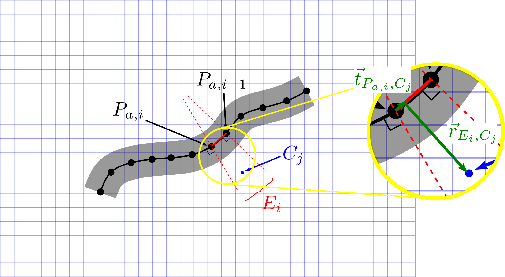

# The Actuator Line Method in Fluent

This is the documentation for the adaptation of the Actuator Line Method (ALM) for textile yarns in air-jet weaving, incorporated in ANSYS Fluent [[1](#1)].


## Fluid-Structure Interaction with `alm_fluent`

The functioning of this solver wrapper is entirely based on the original [Fluent solver wrapper](./fluent.md). Due to the nature of the ALM, there are some important changes, however.
Most importantly, the deformable object is no longer physically present in the flow domain. This changes the workflow somewhat. 
The user should provide a file *`coordinates_timestep0.dat`* containing the initial position of the yarn. The first line should consist of the number of actuator points, 
the other lines declare the position of the actuator points: each line contains the x, y, z coordinates of an actuator point in columns (units of [m]), see e.g. [this unit test file](../../../tests/solver_wrappers/alm_fluent/test_v2023R1/yarn3d/setup_fluent/coordinates_timestep0.dat).
The solver wrapper assumes that the actuator points are sorted by increasing arc length, meaning that the physical neighbours of an actuator point are also neighbours in the coordinates file, leading to a certain connectivity.

In the regular Fluent solver wrapper, both pressure and traction are exchanged with the coupled solver. In contrast, the current ALM framework stores the aerodynamic forces in the traction variable, and as such the pressure variable is not used.


## Known limitations

* Currently, the solver wrapper supports only one yarn in a case. To allow for more actuator line objects in a single simulation, the UDF (*`alm_v2023R1.c`*) should be adapted (adding a dimension to the global variables in lines 50-60 and an additional outer for-loop around each walk through the actuator line object)
as well as the removal of the check at lines 58-60 in the [solver wrapper](./alm_fluent.py).

* Only 3D cases are supported, even though a majority of the [UDF](./alm_v2023R1.c) uses the built-in `ND_ND` to allow for both 2D and 3D cases, the velocity sampling currently relies on the assumption of a fully 3D case.

* The correlation between local relative Reynolds number, yarn orientation and aerodynamic forces is hardcoded in the [UDF](./alm_v2023R1.c) (function `initialize_force_coefficients` and lines 521 and 526 in the function `calculate_yarn_forces`) based on the correlations derived in Bral et al. [[2](#2)].
If one desires alternative relations, because e.g. another type of yarn is investigated, these lines of code should be adapted.

* The aerodynamic forces that the yarn exerts on the flow are introduced in the flow domain by means of momentum source terms. These are defined automatically by CoCoNuT by means of the [journal file](./alm_v2023R1.jou), see line 72. 
However, this line of code is designed and tested specifically for the k-omega SST turbulence model. It is expected (but not tested) that this works for other two-equation turbulence models as well, but it definitely needs adaptation when using other turbulence models such as Spalart-Allmaras or the Reynolds Stress equation Model.

```scheme
(ti-menu-load-string "define boundary-conditions fluid fluid no yes 0 1 no yes \"xmom_source::v2023R1\" 1 no yes \"ymom_source::v2023R1\" 1 no yes \"zmom_source::v2023R1\" 0 0 0 no no no 0 no 0 no 0 no 0 no 0 no 1 no no no no no")
```

* Finally, a word on the resolution of the yarn end. In the figure below, it is shown how a cell center $C_j$ is assigned to a certain actuator element $E_i$ based on its position with respect to the acuator points.
The value of the momentum source terms then depend on the tangential and radial coordinates $\vec{t}$ and $\vec{r}$. This implies that the yarn ends are represented in a sharp manner in the computational domain, as also suggested by the figure.
As a consequence, there is a possibility for a cell half-width error in the smearing of the forces in the flow domain: if a cell center is just within an actuator element, it will consider the complete cell as part of the actuator element, thus making the yarn artificially longer (conversely when a cell center is just not within an actuator element, the yarn will appear shorter than it actually is).  
This error might become significant for short yarns (few actuator elements $E_i$) and a relatively coarse cell compared to the actuator element. Be cautious when simulating short yarns. 
The magnitude of the error can be estimated by comparing the volume integral of the momentum sources in the file *`report-coconut.out`* to the line integral of the aerodynamic forces in the file *`traction_timestepA.dat`* (see e.g. the `test_forces`-method in [the unit tests](../../../tests/solver_wrappers/alm_fluent/alm_fluent.py)).



* In case of a steady-state calculation (`unsteady` set to `False` in the parameter file), the yarn is assumed being at standstill as all calculations happen at timestep 0.


## Parameters

The parameters don't differ much from the ones described in the [Fluent solver wrapper documentation](./fluent.md#parameters), with the following exceptions:

* The keywords `max_nodes_per_face` and `multiphase` are removed. The fromer as no physical yarn surface mesh is present and thus this parameter becomes obsolete, the latter as multiphase is not allowed/supported.
* The keyword `dimensions` is ignored and hardcoded to 3 as only 3D-cases are supported for the moment.
* Regarding the model parts names (under `interface_input` and `interface_output`), the only requirement is that the string given at `thread_names` is a substring of the model part names. As variables, only `displacement` and `traction` should be selected.
* Finally, a new subdictionary with keyword `ALM` should be provided, containing the following keywords:

|       parameter | type  | description                                                                                                                                          |
|----------------:|:-----:|------------------------------------------------------------------------------------------------------------------------------------------------------|
| `yarn_diameter` | float | Diameter of the yarn or flexible object represented by the actuator line (in [m]).                                                                   |
|         `g_eps` | float | Shape parameter of the Gaussian kernel (in [m]). This value is used both for velocity sampling (3D Gaussian) and force regularization (2D Gaussian). |
|      `n_circ_s` |  int  | Number of circumferential velocity sampling points for the axial flow velocity sampling.                                                             |


## Overview of operation

The solver wrapper consists of 3 files (with X the Fluent version, e.g. "v2023R1"):

-   *`alm_X.py`*: defines the `SolverWrapperALMFluentX` class, 
-   *`alm_X.jou`*: Fluent journal file to interactively run the FSI simulation, written in Scheme, 
-   *`alm_X.c`*: Fluent UDF file that calculates the aerodynamic forces, defines the momentum source terms and implements additional functionality (I/O) used in Fluent, written in C.

### Files created during simulation

In these file conventions, A is the time step number.

-   Fluent case and data files are saved as files of the form *`case_timestepA.cas.h5`* and *`case_timestepA.dat.h5`*.
-   Current actuator point coordinates are passed from Fluent to CoCoNuT with files of the form *`nodes_timestepA.dat`*. 
-   The new actuator point coordinates and their tangent vectors are passed from CoCoNuT to Fluent with files of the form *`coordinates_update_timestepA.dat`*.
-   The aerodynamic forces (in [N/m]) are passed from Fluent to CoCoNuT with files of the form *`traction_timestepA.dat`*.
-   A report *`report-coconut.out`* is created that keeps track of the volume integral of the momentum sources in the domain per flow iteration (in the columns 'fx', 'fy' and 'fz'). This allows the user to check the discretization error in the force regularization.
-   Files with extension *`.coco`* are used to exchange messages between CoCoNuT and Fluent. 


## Setting up a new case

Following items should be set up and saved in the Fluent case file (this list may be non-exhaustive):

-   additional UDFs must be configured, 
-   steady/unsteady (should match with the `unsteady` parameter),
-   boundary conditions, material properties, numerical models, discretization schemes, operating conditions, turbulence modeling, convergence criteria.
-   it is important that the fluid zone where the ALM momentum sources are to be applied, has the name `fluid`! This is assumed in the [journal file](./alm_v2023R1.jou) on line 72, where the momentum sources are hooked to the flow equations.

A data file should also be present with the fields either initialized or containing the results of a previous calculation.
Finally, the user should create the file *`coordinates_timestep0.dat`* containing the initial position of the yarn.

In case of a restart, all files at the initial timestep should be present in the working directory, as well as `case_timestepA.cas.h5`, *`case_timestepA.dat.h5`* and *`coordinates_update_timestepA.dat`*, with A the timestep from which the calculation is restarted.

Following items are taken care of by CoCoNuT, and must therefore not be included in the Fluent case file:

-   definition of the momentum sources in the flow domain,
-   the time step (`delta_t`).


## Version specific documentation

### v2023R1 (23.1.0)

Base version.


## References
<a id="1">[1]</a> 
[Bral A., Daelemans L. and Degroote J., "Towards an actuator line representation of the yarn insertion phase in air-jet weaving", 9th European Congress on Computational Methods in Applied Sciences and Engineering (ECCOMAS), Lisbon, Portugal, 3-7 june 2024.](https://www.researchgate.net/publication/381670235_Towards_an_actuator_line_representation_of_the_yarn_insertion_phase_in_air-jet_weaving)

<a id="2">[2]</a> 
[Bral A., Daelemans L. and Degroote J., "A method to determine local aerodynamic force coefficients from fiber-resolved 3D flow simulations around a staple fiber yarn", Multibody System Dynamics, 2024.](https://doi.org/10.1007/s11044-024-09992-2)