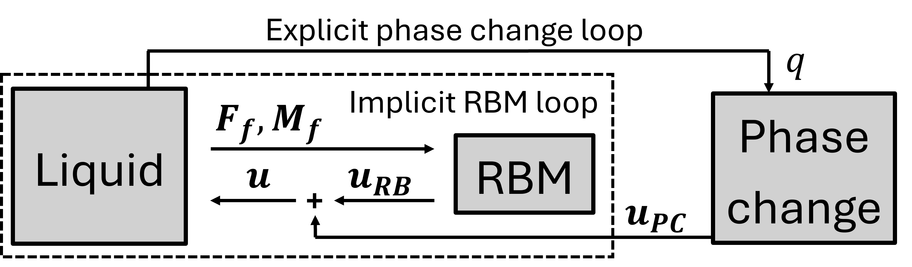

# Phase change in Fluent: Liquid Solver with Rigid Body Motion

This is the documentation for the Fluent liquid solver wrapper equipped with rigid body motion (RBM) capabilities.
The `pc_fluent_liquid_rb` solver wrapper is an advanced extension of the standard [Fluent liquid solver wrapper](../pc_fluent_liquid/pc_fluent_liquid.md).
It is explicitly designed to simulate unconstrained close-contact melting, where the solid bulk undergoes continuous translation and rotation driven by hydrodynamic forces, gravity, and contact interactions.

## Motivation for a dedicated rigid body motion wrapper

Standard fixed-grid approaches, such as the enthalpy-porosity method, struggle to capture unconstrained melting because modifying the mushy zone constant inevitably compromises either the solid's rigidity or its ability to sink.
To bypass these numerical artefacts, this wrapper employs a partitioned fluid-structure interaction methodology.
The complex fluid dynamics are delegated to ANSYS Fluent, while a dedicated external Rigid Body Motion (RBM) Python solver explicitly resolves the kinematics of the solid.

## Code architecture

Unconstrained melting introduces a dual boundary motion mechanism: the interface recedes locally due to melting (thermal phase change), while the entire solid boundary shifts globally due to bulk translation and rotation (mechanical motion).
To capture both phenomena, the coupling architecture features two distinct interacting loops managed by the `solve_solution_step` function.

1.  **Explicit thermal loop:** The liquid solver evaluates the temperature field and passes the interfacial heat flux to the solid solver. The solid solver uses the Stefan condition to compute the local interface regression and passes this melting displacement back to the liquid solver.
2.  **Implicit mechanical loop:** A `while` loop within `solve_solution_step` continuously triggers Fluent to integrate the fluid pressure and shear stress along the interface. These loads are transmitted to the `RBMSolver` class, which computes the global bulk translation and rotation. This implicit loop iterates until the residual differences of the fluid forces and moments drop below a predefined tolerance.

Ultimately, the total displacement applied to the liquid domain mesh is the exact vector superposition of both the local melting displacement and the global rigid body displacement.

The detailed methodology of this partitioned approach for unconstrained solids is explained in [[1](#1)].
This solver wrapper serves as the practical implementation of that theory and was used to conduct the simulations presented in that publications.
The figure below illustrates the exchange of interface variables for the explicit thermal and implicit mechanical coupling of the liquid and solid solvers.

## The Rigid Body Python Solver (`rbm_solver.py`)

The purely mechanical physics are abstracted into the `RBMSolver` class.
This class maintains the historical kinematic states and executes the time integration.
Key code features include:

*   **Fast distance queries:** The `initialise_walls` method constructs a `cKDTree` from the domain boundary coordinates. The `_calculate_h_min` method then queries this tree to instantly find the minimum gap width between the solid and the wall. This gap width determines both the activation of the contact model and the magnitude of the fictitious mass.
*   **Fictitious mass stabilisation:** To stabilise the implicit Gauss-Seidel iterations against severe added-mass and lubrication effects, the `step` method calculates an effective fictitious mass (`M_sys`). This term is implicitly added to the acceleration calculation to heavily dampen unphysical oscillations during sub-iterations.
*   **Quaternion rotation:** To track the solid's orientation and prevent gimbal lock, the solver uses unit quaternions (`quat_multiply`, `quat_from_angular_velocity`). The `rotate_displacement` function uses these quaternions to efficiently map the melting displacements from the solid's local coordinate frame to the liquid's global frame.
*   **Multi-patch contact modelling:** If nodes penetrate the predefined contact zone, `_calculate_h_min` groups them into discrete patches using a flood-fill algorithm. A repulsive viscoelastic penalty force is subsequently evaluated for each patch in `_calc_contact_force_and_moment` using a normalised weighted average.

## The Fluent UDF Implementation (`udf_thermal.c`)

The C-code interacting directly with the Fluent solver relies heavily on User-Defined Memory (UDM).

*   **Geometric and force calculation:** The `store_rigid_body` UDF applies the divergence theorem to dynamically calculate the solid's instantaneous volume, centre of mass, and moment of inertia purely from the boundary faces. Additionally, this UDF integrates the static pressure and viscous shear stress to compute the total hydrodynamic force and moment acting along the solid-liquid interface.
*   **Swept volume calculation:** The `calc_volume_change` UDF applies the shoelace theorem to the coordinates of the previous and new time steps to calculate the exact swept volume of the interface faces. For this, only the displacment due to phase change is taken into account.
*   **Source terms:** The computed swept volume is fed directly into `udf_mass_source`, `udf_energy_source`, `udf_xmom_source`, and `udf_ymom_source` to explicitly add or remove the mass, energy, and momentum associated with the volume change of the liquid domain. Crucially, the momentum injected into the fluid corresponds exclusively to the rigid body motion that is imparted to the newly molten solid as it crosses the interface and enters the liquid phase.

## Known limitations and untested conditions

*   Only 2D planar cases are supported. Axisymmetric or 3D cases are currently not supported due to the 2D assumptions in the shoelace swept volume integration and the 3-DoF limitation in the `RBMSolver` kinematics.
*   Currently, only melting is supported. Solidification is not supported.
*   The moving solid phase can only be tracked using overset meshing because the solver wrapper has been build on that assumption.
*   Subcooled solids can be simulated but should be initialised such that the phase change interface is already at melting temperature.

## Parameters

This wrapper inherits all parameters used in the standard liquid solver wrapper.
In addition to the `PC` (Phase Change) dictionary, new dictionaries for `RB` (Rigid Body), `contact_model`, and `overset_boundaries` must be provided.

### Phase Change (`PC`) Settings

*Note: This builds upon the standard phase change parameters. The following parameters are newly required for unconstrained melting.*

|                 parameter | type  | description                                                                                                                                                                    |
|--------------------------:|:-----:|--------------------------------------------------------------------------------------------------------------------------------------------------------------------------------|
|         `volume_change`   | bool  | (optional) Default: `true`. If `false`, the density difference between solid and liquid is used *only* to calculate buoyancy for the rigid body motion, not for volume change. |
|        `liquid_density`   | float | The density of the liquid phase. Required to accurately calculate buoyancy forces for unconstrained phase change problems.                                                     |

### Rigid Body (`RB`) Settings

|                 parameter | type  | description                                                                                                                              |
|--------------------------:|:-----:|------------------------------------------------------------------------------------------------------------------------------------------|
|             `tolerance`   | float | (optional) Default: **1e-6**. The absolute convergence tolerance for the integrated fluid forces and moments between sub-iterations.     |
|         `iteration_min`   | int   | (optional) Default: **1**. Minimum number of mechanical sub-iterations per time step.                                                    |
|         `iteration_max`   | int   | (optional) Default: **10**. Maximum number of mechanical sub-iterations per time step.                                                   |
|            `restart_rb`   | int   | (optional) Default: **0**. The specific time step from which to load rigid body restart data.                                            |
|            `fict_coeff`   | float | (optional) Default: **0.0**. The scaling factor applied to the fictitious mass and damping to stabilise the implicit RBM solver.         |
|       `fict_multiplier`   | float | (optional) Default: **1.0**. A multiplier applied to the fictitious mass specifically during the very first time step.                   |
|       `liquid_dyn_visc`   | float | (optional) Default: **0.0**. The dynamic viscosity of the liquid PCM, required to calculate the fictitious damping.                      |
|               `fm_wall`   | str   | (optional) The name of the specific wall boundary used to calculate the characteristic gap length for fictitious mass evaluation.        |
|     `relaxation_method`   | str   | (optional) Default: **'static'**. Options: **'static'** or **'aitken'**. Defines the relaxation strategy for forces and moments.         |
|            `relaxation`   | float | (optional) Default: **1.0** (no relaxation). The under-relaxation factor used if the static relaxation method is chosen.                 |
|        `relax_first_ts`   | bool  | (optional) Default: `false`. If `true`, applies force and moment relaxation during the very first time step and coupling iteration.      |
|             `predictor`   | str   | (optional) Default: **'constant'**. Options: **'constant'** or **'linear'**. The velocity predictor scheme for the subsequent time step. |
|     `rotational_update`   | str   | (optional) Default: **'quaternion'**. Options: **'off'**, **'rot_mat'**, or **'quaternion'**. The mathematical method used for rotation. |
|              `buoyancy`   | bool  | (optional) Default: `true`. If `true`, applies theoretical buoyancy forces. Set to `false` if buoyancy is resolved in the fluid pressure.|
|               `gravity`   | list  | (optional) Default: **[0, -9.81, 0]**. A 3-element list defining the gravitational acceleration vector.                                  |
|              `x_motion`   | bool  | (optional) Default: `true`. If `false`, restricts rigid body translation in the x-direction.                                             |
|           `weight_ramp`   | int   | (optional) Default: **0**. The number of time steps over which gravitational forces are gradually ramped up to prevent initial shocks.   |

### Contact Model (`contact_model`) Settings

|                 parameter | type  | description                                                                                                                              |
|--------------------------:|:-----:|------------------------------------------------------------------------------------------------------------------------------------------|
|         `contact_force`   | bool  | (optional) Default: `false`. Enables the multi-patch contact model to prevent mesh collisions.                                           |
|             `gap_walls`   | list  | A list of string names for the stationary boundary walls that the solid could potentially collide with.                                    |
|           `upper_limit`   | float | (optional) Default: **2e-4** (m). The penetration distance at which the repulsive contact forces become active.                          |
|           `lower_limit`   | float | (optional) Default: **2e-4** (m). The absolute hard-stop distance preventing any further motion toward the wall.                         |
|         `damping_ratio`   | float | (optional) Default: **1.0** (critically damped). Damping ratio for the viscoelastic penalty force.                                       |
|                `k_mass`   | float | (optional) Default: **1.0**. A multiplier applied to the mass used to compute the harmonic oscillator stiffness of the contact model.    |

### Overset Boundaries (`overset_boundaries`)

A dictionary mapping the names of the inner solid boundaries (component mesh) to the names of the corresponding overset boundaries in the fluid domain.

## Overview of operation

The solver wrapper consists of 3 files (with X the Fluent version, e.g. "v2024R2"):

*   *`X.py`*: defines the `SolverWrapperPCFluentLiquidRB` class.
*   *`rbm_solver.py`*: defines the `RBMSolver` class for rigid body motion.
*   *`X.jou`*: Fluent journal file to interactively run the simulation, written in Scheme.
*   *`udf_thermal.c`*: Fluent UDF file that implements the mass and energy source terms, mesh motion, and additional I/O functionality.

### Files created during simulation

In these file conventions, A is the time step number and B the Fluent thread ID.

*   Fluent case and data files are saved as *`case_timestepA.cas.h5`* and *`case_timestepA.dat.h5`*.
*   Node and face coordinates are passed from Fluent to CoCoNuT as *`nodes_timestepA_threadB.dat`* and *`faces_timestepA_threadB.dat`*.
*   The total superimposed node displacements are passed from CoCoNuT to Fluent as *`nodes_update_timestepA_threadB.dat`* to deform the component mesh.
*   The phase-change-only node displacements are passed as *`nodes_pc_timestepA_threadB.dat`* to accurately calculate the swept volume for mass and energy source terms.
*   The rigid body translational and rotational velocities are passed to Fluent as *`RB_update_timestepA.dat`* to drive the overset boundary motion and explicitly define the momentum source terms.
*   The integrated fluid forces, moments, and geometric properties (volume, centre of mass) are received from Fluent via *`rigid_body_timestepA.dat`*.
*   Stationary wall coordinates are extracted from Fluent via *`nodes_{wall_name}.dat`* to build KD-trees for the multi-patch contact model and fictitious mass tracking.
*   Thread ID mappings between CoCoNuT and Fluent are written to *`bcs.txt`*, *`bcs_overset.txt`*, and *`gap_wall.txt`*.
*   A human-readable kinematic tracking history is appended continuously to *`rigid-body-report-file.out`*.
*   Rigid body state data required for exact restarts is saved sequentially as *`restart_rb_timestepA.pickle`*.
*   Generic input and output variables (e.g., temperature, heat flux, pressure, traction) are exchanged as *`[variable_name]_timestepA_threadB.dat`*.
*   Files with extension *`.coco`* are used to exchange messages between CoCoNuT and Fluent.

## Setting up a new case

The following items should be configured in the Fluent case file:

*   Additional UDFs must be compiled and hooked.
*   Steady/unsteady settings (must match the `unsteady` parameter).
*   2D planar solver. Axisymmetric and 3D are currently not supported.
*   Multiphase VOF model must be enabled if `multiphase` is set to `true`. Furthermore, the name of the active phase change material in Fluent must exactly match the `pcm_name` parameter.
*   Only laminar or kw-sst viscous models are supported.
*   Dynamic mesh zones must be configured for all deforming surfaces, excluding the coupling interfaces. The overset boundaries must also be assigned as rigid body dynamic mesh zones.
*   If the multi-patch contact model or the fictitious mass stabilisation is enabled, the stationary boundary names in Fluent must perfectly match those provided in the `gap_walls` and `fm_wall` configuration parameters.
*   Boundary conditions, material properties, numerical models, and operating conditions.

## Version specific documentation

*   **v2024R2 (24.2.0)**: First version.

## References

<a id="1">[1]</a>
[V. Van Riet, W. Beyne, and J. Degroote, “A partitioned interface-tracking method for close-contact melting of unconstrained saturated solids,” submitted to Int. J. Heat Mass Transfer., 2026.]
