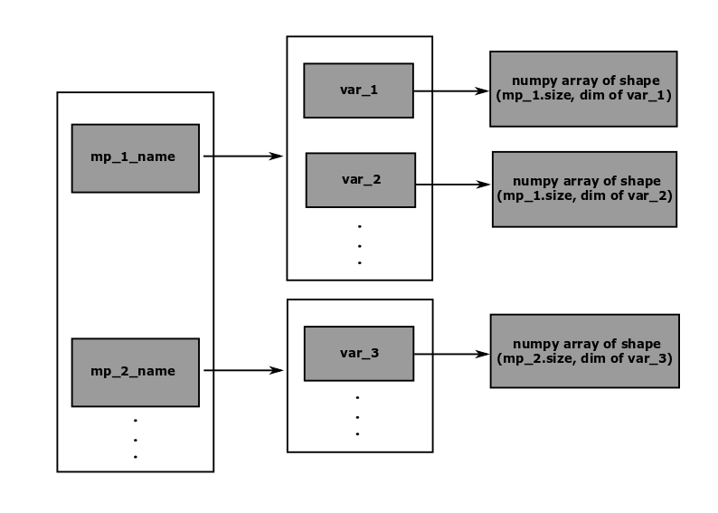

# Data structure
The data structure in CoCoNuT contains different classes that serve as 
containers of various types of data that are transferred between the 
components of CoCoNuT during the partitioned coupling. It consists of 
the following three classes:

-  `Model`
-  `ModelPart`
-  `Interface`

## Model
`Model` is simply a `dict` with keys as model part names and values as the 
reference to model parts. It serves as a container of instances of 
`ModelParts`. Additionally, it has one important method called 
`create_model_part`, which as the name suggests, creates an instance of the 
class `ModelPart` and adds it to the dictionary.

## ModelPart
`ModelPart` is a container of boundary points, that are involved in the 
partitioned coupling. This contains the initial coordinates- 
`x0`, `y0`, `z0` (`1D numpy float array`), and point ids-`id` 
(`1D numpy int array`). It is recommended to always instantiate `ModelPart` 
using the `create_model_part` method of the class `Model`, discussed above. 
Naturally, the size of `x0`, `y0`, `z0`, and  `id` should be equal, which is 
checked in the `__init__` method.

---

**NOTE**:<br>
The data in `ModelPart` once created, either by `__init__` method of 
the `ModelPart` class or by `create_model_part` method of the `Model` class, 
cannot be changed later. This is because the initial coordinates of boundary 
points are always supplied from the solver wrapper and they don't change during the various stages of the coupling process. 

--- 

## Interface

`Interface` stores the `variable` data that are transferred between the 
different components (`coupling_components`) of CoCoNuT to perform partitioned
 coupling. Additionally, it contains a reference to an instance of `Model`, 
 usually created in the solver wrapper. As described above, the `Model` contains 
several model parts corresponding to the boundaries in the solver wrappers. 
Therefore, in a way, the interface also contains coordinates of the boundary 
points that are involved in the coupling. <br>

The data in the interfaces are stored as `numpy arrays` in a nested `dict`. 
The following schematic illustrates the data structure in the 
`Interface` class, where the arrow points from a key to the value in the 
`dict`:<br>


For example, in the schematic above, the interface has a model part named 
"mp_1_name", which has several variable data. The data for the variable `var_1` is stored in a `numpy array` with the number of rows equal to the number points in the model part and the number of columns equal to the number of components/dimensions of the variable. The number of dimensions for a variable 
is defined in the `variable_dimensions` `dict` in the file 
`data_structure/variables.py`variables.py, e.g the number of dimensions for the variables 
`pressure` and `displacement` is 1 and 3, respectively. <br>

The nested `dict` in the `Interface` is constructed during the instantiation
 of the class using a parameters `dict` given as an input argument. For the 
 schematic shown above, the parameters dict would be:<br>
 
 ````
 [
    {
      "model_part": "mp_1_name",
      "variables": ["var_1", var_2, ..]
      ]
    },
    {
      "model_part": "mp_2_name",
      "variables": ["var_3",  ..]
      ]
    },
    .
    .
    .
 ]
 ````
 
The data in the interface can be accessed, added, or replaced by the various 
methods implemented in the `Interface` class, which can be looked in the file 
`data_structure/interface.py`.

---

**NOTE**:<br>
The file *`data_structure/variables.py`* does not contain a class definition. 
It has a `dict` called `variable_dimensions` with keys as data 
variable names (`string`) and values as the number of components or dimensions 
(`int`). One important point to note is that only variables defined in this 
dictionary can be used in CoCoNuT. To use a new variable, the user first 
needs to add the variable name and its number of components in this `dict`.

---