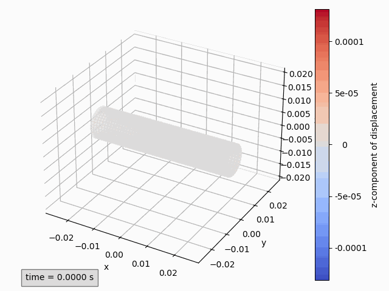
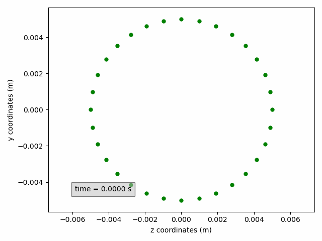

# Post-processing

As described in the [coupled solver documentation](../../coupling_components/coupled_solvers/coupled_solvers.md#save-results), a pickle file can be saved to store details on the computation.
This includes

- solution data on the interface, 
- position of the data points on the interface, 
- details on the convergence behaviour, such as number of coupling iterations and coupling residuals,
- distribution of the elapsed simulation time,
- and history of the simulation, such as restarts.

This information can be accessed by loading the pickle file, for example for a file _`case_results.pickle`_:
```python
import pickle
with open('case_results.pickle', 'rb') as f:
    data = pickle.load(f)
```

Nevertheless, CoCoNuT also provides a more user-friendly tool to visualize and inspect this information.

## The class PostProcess
Instead of loading the pickle file directly, its path can be used to create an instance of the `PostProcess` class.
```python
from coconut.examples.post_processing.post_processing import *
pp = PostProcess('case_results.pickle')
```

!!! Info

    The example code in this document has been created for the _`tube/openfoam3d_kratos_structure3d`_ example.

Printing this class provides an overview of the simulation, for example
```python
print(pp)
```
will output a statement analogous to
```
PostProcess of pickle file case_results.pickle
Containing 100 time steps with size 0.0001s
Coupling
    interface "interface_x" consisting of
        model part "mantle_input" with variables
            displacement (vector)
    interface "interface_y" consisting of
        model part "mantle_output" with variables
            pressure (scalar)
            traction (vector)
```

Among the methods of this class are:

- The method `print_summary()` prints a summary of the elapsed simulation time and its distribution over the different components, similar to the summary outputted at the end of a simulation.
	
    ```python
	pp.print_summary()
	```
  
- The method `print_info()` prints information on when the simulation was started and if it was restarted as well as on which machine it has been run.
	
    ```python
	pp.print_info()
	```

- The method `get_data()` returns a copy of the data in the pickle file.

- The method `get_residual_history()` returns a copy of the list of coupling residuals (nested list, which contains for each time step a list of the coupling residuals of that time step).

- The method `get_coupling_iterations()` returns a copy of the list of the number of coupling iterations per time step.

- The method  `add_subset(**kwargs)` allows to create and add a subset of selected points and/or time steps.
	This will prove useful for extracting data and making plots or animations.
	It requires several keyword arguments as detailed by the [`SubSet` documentation](#the-class-subset).
	Multiple `SubSets` can be added.
    A list containing the added `SubSets` can be accessed through the `get_subsets()` method.

## The class SubSet

A `SubSet` is always added to a `PostProcess` instance and is used to select particular points and/or time steps.
A `SubSet` needs to be defined on a single [interface](../../data_structure/data_structure.md#interface) and [model part](../../data_structure/data_structure.md#modelpart).
The selection of points thus needs to be within a single model part. If points from multiple model parts are required, multiple `SubSets` have to be added.

If our example above only has one model part for both the x- and y-interface, this might be done as follows.
```python
sx = pp.add_subset(interface='interface_x')
sy = pp.add_subset(interface='interface_y')
```
`'interface_x'` and `'interface_y'` refer to the input and output interface of the first solver, respectively.
The first solver is typically the flow solver such that `'interface_x'` contains displacement values 
and `'interface_y'` contains pressure and traction values.

!!! info "The interfaces of the second solver are not accessible, since they are not stored!"

If in our examples, there would have been multiple model parts, an error would have been raised when adding the subset, because the declaration is ambiguous.
In that case, the model part would also have to be specified.
The full set of possible arguments is given below.

| keyword argument          |                           type/value | description                                                                                                                                                                                                                                                             |
|---------------------------|-------------------------------------:|:------------------------------------------------------------------------------------------------------------------------------------------------------------------------------------------------------------------------------------------------------------------------|
| `interface`               |   `'interface_x'` or `'interface_y'` | (optional) Indicates whether the `SubSet` is created on the input interface of the first solver (`'interface_x'`) or the output interface of the first solver (`'interface_y'`). Note that a `SubSet` cannot be defined with multiple interfaces!                       |
| <nobr>`model_part`</nobr> |                                  str | (optional) Chooses the model part from which the `SubSet` is created. Note that a `SubSet` cannot be defined with multiple model parts! The model part names of a `PostProcess` instance can be accessed with the method ´get_model_part_names()´.                      |
| `variable`                |                                  str | (optional) Selects the variable of which data needs to be outputted for the selected points and time step. These are the calculation variables specified in the JSON file, plus the variable `'coordinates'`. For example `'displacement'`, `'pressure'`, `'traction'`. |
| `component`               | `'x'`, `'y'`, `'z'`, `0`, `1` or `2` | (optional) Selects the component of the variable that needs ot be outputted in case of a vector variable. `0`, `1` and `2` correspond to  `'x'`, `'y'`and `'z'`, respectively.                                                                                          |
| `sort`                    |                                tuple | (optional) Default: `(0, 1, 2)`. Priority for ordering points. By default, the points are ordered first by x-coordinate, then y-coordinate and finally z-coordinate.                                                                                                    |

While the interface and model part cannot be changed once the `SubSet` is created, the variable and component can be modified on the fly.

### Selecting points

To make a selection of points the method `select_points(p_mask)` is used, where `p_mask` is a one-dimensional numpy-array containing boolean values and with a length equal to the number of points in the model part.
A `True` value selects the corresponding point, whereas a `False` value deselects it.

The recommended approach is using inequalities on the output of `get_initial_coordinates()`, which returns a two-dimensional array, where the rows are the points and the three columns correspond to the three components, x, y and z, respectively.
The following example selects points with a z-coordinate close to zero and a positive y-component.
```python
initial_coordinates = sx.get_all_initial_coordinates()
mask1 = abs(initial_coordinates[:, 2]) < 0.0005
mask2 = initial_coordinates[:, 1] > 0
sx.select_points(mask1 & mask2)

initial_coordinates = sy.get_all_initial_coordinates()
mask1 = (initial_coordinates[:, 2] > 0) & (initial_coordinates[:, 2] < 0.0005) # (1)!
mask2 = initial_coordinates[:, 1] > 0
sy.select_points(mask1 & mask2)
```

1.  The specific inequalities in which the points are selected are case specific. Here for example, the points on the `y-interface` are not located exactly on the xy-plane, but just next to it. The points with a positive z-coordinate close to zero are selected.

These methods are also useful:

- `get_size()` returns the size of the selection,
- `get_initial_coordinates_selection()` returns the initial coordinates of the selection,
- `reset_points_selection()` undoes point selection, in other words, selects all points.

### Selecting times

The selection time steps occurs analogously to selection of points.
The following methods are available:

- `select_times(t_mask)` selects time step based on a boolean mask with length equal to the number of time steps **plus one** to account for the initial time value,
- `get_all_times()` returns a one-dimensional array with all time instances,
- `get_all_steps()` returns a one-dimensional array with all time steps numbers (for example `[0, 1, 2, ...]`),
- `get_num_steps()` returns the size of the selection,
- `get_times_selection()` returns the time instances of the selection,
- `get_steps_selection()` returns the time step numbers of the selection,
- `reset_times_selection()` undoes time selection, in other words, selects all time instances.

### Getting solution data

Once the desired points and time steps have been selected, the solution data can be accessed with the method `get_values(**kwargs)`.
The possible arguments are:

| keyword argument         |                           type/value | description                                                                                                                                                                                                                                                             |
|--------------------------|-------------------------------------:|:------------------------------------------------------------------------------------------------------------------------------------------------------------------------------------------------------------------------------------------------------------------------|
| `variable`               |                                  str | (optional) Selects the variable of which data needs to be outputted for the selected points and time step. These are the calculation variables specified in the JSON file, plus the variable `'coordinates'`. For example `'displacement'`, `'pressure'`, `'traction'`. |
| <nobr>`component`</nobr> | `'x'`, `'y'`, `'z'`, `0`, `1` or `2` | (optional) If not present, all available components are returned. Selects the component of the variable that needs ot be outputted in case of a vector variable. `0`, `1` and `2` correspond to  `'x'`, `'y'`and `'z'`, respectively.                                   |

If no variable argument is provided, the previously set value is used.
If there was no variable set earlier and more than one is available, an error is raised to point the user to the ambiguity.

!!! tip

	The available variables can be accessed through the method `get_available_variables()`.

For vector variables, without specifying a component, the output of this method is a three-dimensional numpy array, where

- the first axis corresponds to the time step,
- the second axis to the points,
- and the third to the component.

For scalar variables or when a component is specified, the output is a two-dimensional numpy array, where

- the first axis corresponds to the time step,
- the second axis to the points.

In our example, we can get the x- and y- coordinates of the selected points as follows
```python
x_coordinates = sx.get_values('coordinates', 'x')
y_coordinates = sx.get_values(component='y')
```
or get the pressure values with
```python
pressure = sy.get_values('pressure')
```

## Visualization

With the classes above, custom data analyses or visualizations are possible.
However, CoCoNuT also offers built-in tools for the most common visualizations.

For different types of visualization, different classes are available in ´post_processing.py´.
A distinction is made between, on the one hand,

- an Animation (moving in time),
- or a Plot (static),

and, on the other hand,

- 2d (for example, y-displacement in function of x-coordinate)
- or 3d (plotting points in 3d space).

### Quick guide to visualizations

The quickest way to create a visualization is through the pre-made classes.
These require a (collection of) `SubSet` and in some cases the components of the variables to show.
In our example, the y-displacement of the selected points can be animated in function of the initial x-coordinate as follows
```python
Animation2dDisplacement(sx, x_component='x', y_component='y')
```


!!! success

	Don't forget to add `plt.show()` at the end to show the plot(s) or animation(s).

!!! tip

	In these pre-made classes, a `PostProcess` instance can be provided directly as subset.
	All model parts of this `PostProcess` instance will be automatically added to the visualization.

__Two-dimensional animations__ show one variable on the ordinate (y-axis) in function of a variable on the abscissa (x-axis).

- `Animation2dDisplacement(subset, x_component, y_component)`: animates `y-component` of the displacement in function of the `x-component` of the initial coordinates.
- `Animation2dCoordinates(subset, x_component, y_component)`: animates `y-component` of the instantaneous coordinates in function of the `x-component` of the instantaneous coordinates.
- `Animation2dPressure(subset, x_component)`: animates pressure in function of the `x-component` of the initial coordinates.
- `Animation2dTraction(subset, x_component, y_component)`: animates `y-component` of the traction in function of the `x-component` of the initial coordinates.

Replacing the word _Animate_ with _Plot_, __Two-dimensional plots__ are completely analogous, but are typically used to only show one time instance.
This can be selected when creating the `SubSet`, or on the fly with the keyword arguments `time_step` (time step number) or `time` (time in seconds).
Only one of these parameters should be provided.
In our example, the pressure can be plotted at time 0.001 s.
```python
Plot2dPressure(sy, x_component='x', time=0.001) # (1)!
```

1.  If the time step is 0.0001 s, for example, this is identical to the argument `time_step=10`.


__Three-dimensional animations__ show the coordinates of points and possibly color them by a variable.
Instantaneous coordinates are used when available colors, otherwise initial coordinates are used.

??? info "When are instantaneous coordinates available?"

	Instantaneous coordinates are only available for interfaces that have the displacement variables.
	This is typically `interface_x`. For other interfaces, only the initial coordinates are available.

- `Animation3dDisplacement(subset)`: animates the instantaneous coordinates and colors the points by magnitude of displacement.
- `Animation3dCoordinates(subset)`: animates the instantaneous coordinates without coloring.
- `Animation3dPressure(subset)`: animates the initial coordinates and colors the points by pressure values.
- `Animation3dTraction(subset)`: animates the instantaneous coordinates and colors the points by magnitude of traction.

If the variable by which the points are colored is a vector, also one of the components can be used instead of the magnitude by including the keyword argument `component`.
For example to animate the z-component of displacement:
```python
Animation3dDisplacement(pp, component='z') # (1)!
```

1.  Here a `PostProcess` instance is used, instead of a `SubSet`. This is only possible for the pre-made classes presented in this section.



Again __Three-dimensional plots__ are analogous replacing the word _Animate_ with _Plot_ and optionally adding the keyword argument `time_step` or `time`.s

#### Saving figures

The method `save(file_path)` can be used to store the plot or animations.
If no `file_path` is provided, the `figure_name` is used with extension `.png` for plots and `.gif` for animations.

By default, for saving animations, the Matplotlib writer PillowWriter is used:
```python
writer = ani.PillowWriter(fps=15, metadata=dict(artist='CoCoNuT'), bitrate=1800)
```
This can be overwritten with the method `set_writer(writer)`.

### Complete guide to visualizations

The pre-made classes discussed above are in fact child classes of the classes `Animation`, `Plot`, `Figure2d` and `Figure3d`,
in which several parameters are pre-set.

The required positional argument is `subset`.

| argument |                                                 type | description                            |
|----------|-----------------------------------------------------:|:---------------------------------------|
| `subset` | `SubSet` or collection (list, tuple, ...) of SubSets | `Subset(s)` to be shown in the figure. |

For two-dimensional figures (`Figure2d`), there are two additional required positional arguments.

| argument                  | type | description                                        |
|---------------------------|-----:|:---------------------------------------------------|
| <nobr>`x_variable`</nobr> |  str | The variable to be shown on the abscissa (x-axis). |
| `y_variable`              |  str | The variable to be shown on the ordinate (y-axis). |

These variables are the calculation variables specified in the JSON file, plus the variable `'coordinates'` and `'initial_coordinates'`. For example `'displacement'`, `'pressure'`, `'traction'`.

Furthermore, there are several optional keyword arguments that apply to all `Figures`.

| keyword argument              |               type/value | description                                                                                                                                                                                                                                                                                                                                                                                                                                                                   |
|-------------------------------|-------------------------:|:------------------------------------------------------------------------------------------------------------------------------------------------------------------------------------------------------------------------------------------------------------------------------------------------------------------------------------------------------------------------------------------------------------------------------------------------------------------------------|
| `figure_name`                 |                      str | (optional) Name of the figure, shown as title of the plot window. Default is the class name. This name has to be unique. If a figure with the provided name exists, a number will automatically be appended.                                                                                                                                                                                                                                                                  |
| `aspect`                      |   `'auto'` or `'aspect'` | (optional) If `'auto'` (default for 2d), the axis scaling of the axes is chosen to fill the plot window. If `'aspect' (default for 3d), alle axes are scaled in the same way.                                                                                                                                                                                                                                                                                                 |
| <nobr>`print_function`</nobr> |      `False` or function | (optional) If not provided, the time is printed. Use `False` to disable or provide a custom function which receives time as single argument and returns a string.                                                                                                                                                                                                                                                                                                             |
| `text_box_style`              |                     dict | (optional) Dictionary with settings determining the text box style. Default: `dict(facecolor='silver', edgecolor='black', pad=5.0, alpha=0.5)`                                                                                                                                                                                                                                                                                                                                |
| `text_location`               |      tuple of two floats | (optional) Window coordinates of the text box. Default: for 2d `(0.1, 0.1)`, for 3d `(0, 0)`.                                                                                                                                                                                                                                                                                                                                                                                 |
| `name`                        | str or collection of str | (optional) Name(s) of the `SubSet(s)` used in the legend and to identify the `SubSet`. If not provided, the `case_name` of the simulation appended by the model part name is used. If a collection of `SubSets` is provided: the value can be a single string, which will be appended with a number, or a collections of strings with the same length. This name is used to identify SubSets and has to be unique. Therefore, a number will appended if this is not the case. |

Finally, there are keyword arguments that are specific to a type of class.

For two-dimensional figures (`Figure2d`), there are two optional keyword arguments.

| keyword argument           |                           type/value | description                                                                                                                    |
|----------------------------|-------------------------------------:|:-------------------------------------------------------------------------------------------------------------------------------|
| <nobr>`x_component`</nobr> | `'x'`, `'y'`, `'z'`, `0`, `1` or `2` | Required if `x_variable` is not scalar. Selects the component of the variable that needs to be shown on the abscissa (x-axis). |
| `y_component`              | `'x'`, `'y'`, `'z'`, `0`, `1` or `2` | Required if `y_variable` is not scalar. Selects the component of the variable that needs to be shown on the ordinate (y-axis). |
 
`0`, `1` and `2` correspond to  `'x'`, `'y'`and `'z'`, respectively.

For three-dimensional figures (`Figure3d`), there are three optional keyword arguments.

| keyword argument         |                                 type/value | description                                                                                                                                                                                             |
|--------------------------|-------------------------------------------:|:--------------------------------------------------------------------------------------------------------------------------------------------------------------------------------------------------------|
| `variable`               | `'coordinates'` or `'initial_coordinates'` | (optional) Determines whether instantaneous or initial coordinates are shown. Default: instantaneous coordinates when available, otherwise initial coordinates.                                         |
| `color_by`               |                                        str | (optional) Variable by which the points are colored. These variables are the calculation variables specified in the JSON file, plus the variable `'coordinates'`. If not provided, no coloring is done. |
| <nobr>`component`</nobr> |       `'x'`, `'y'`, `'z'`, `0`, `1` or `2` | (optional) Component of the `color_by` variable used for coloring the points. If not provided while `color_by` is a vector variable, the magnitude is used for coloring.                                |

For plots (`Plot`), there are two optional keyword arguments.

| keyword argument         |  type | description                                                                                                                                                    |
|--------------------------|------:|:---------------------------------------------------------------------------------------------------------------------------------------------------------------|
| <nobr>`time_step`</nobr> |   int | (optional) Time step number of the data to be shown. If not provided, while the `SubSet` contains more than one time instance, the initial time step is used.  |
| `time`                   | float | (optional) Time (in seconds) of the data to be shown. If not provided, while the `SubSet` contains more than one time instance, the initial time step is used. |

Either `time_step` or `time` should be provided. If both are present, `time` is ignored.
The `time_step` or `time` can be set using the methods `set_time_step(time_step)` or `set_time(time)`.
For the former, also see [Adding multiple subsets](#adding-multiple-subsets) when subsets are added with multiple time step sizes. 

For animations (`Animation`), there is one optional keyword argument.

| keyword argument                      | type | description                                                                                                                                                                                       |
|---------------------------------------|-----:|:--------------------------------------------------------------------------------------------------------------------------------------------------------------------------------------------------|
| <nobr>`func_animation_setting`</nobr> | dict | (optional) Dictionary with settings relating to the animation. For details see the [Matplotlib documentation](https://matplotlib.org/stable/api/_as_gen/matplotlib.animation.FuncAnimation.html). |

A non-extensive overview is shown below:

| setting                   |         type |                        default                        | description                                                                                                                                                                                                                                                                                                                                                                                                         |
|---------------------------|-------------:|:-----------------------------------------------------:|---------------------------------------------------------------------------------------------------------------------------------------------------------------------------------------------------------------------------------------------------------------------------------------------------------------------------------------------------------------------------------------------------------------------|
| `frames`                  | int or range | all available time steps skipping according to `skip` | Determines which time steps are shown. Also see [Adding multiple subsets](post_processing.md#adding-multiple-subsets) when subsets are added with multiple time step sizes. If range, the sequence of time steps to be shown. If int, the number of time steps to be shown starting from the initial time step, skipping according to `skip`. If not provided all time steps are shown,skipping according to `skip` |
| `skip`                    |          int |                          `0`                          | Determines how many time steps are skipped between each shown frame, for example to show 1 time step every 10, use 9. Also see [Adding multiple subsets](post_processing.md#adding-multiple-subsets) when subsets are added with multiple time step sizes.  Only used if `frames` is not provided or if `frames` is an int. This useful to speed up the animation.                                                  |
| <nobr>`save_count`</nobr> |          int |                   number of frames                    | Numbers of frames to cache.                                                                                                                                                                                                                                                                                                                                                                                         |
| `interval`                |          int |                         `200`                         | Delay between frames in milliseconds. Increase to obtain a slower playing speed.                                                                                                                                                                                                                                                                                                                                    |
| `repeat`                  |         bool |                        `True`                         | Whether the animation repeats when the sequence of frames is completed.                                                                                                                                                                                                                                                                                                                                             |


??? Failure "Blitting is not supported."

	Blitting is an approach to optimize drawing by rendering all non-changing graphic elements into a background image once.

For example, to animate the displacement as before, but only show one time step every five, for the first 50:
```python
Animation2dDisplacement(sx, x_component='x', y_component='y',  func_animation_settings=dict(frames=50, skip=4))
```

or equivalently

```python
Animation2d(sx, 'initial_coordinates', 'displacement', x_component='x', y_component='y',  func_animation_settings=dict(frames=50, skip=4))
```

!!! tip

    To change these animations settings after initialization, you case use the method `set_func_animation_settings()`:
    ```python
    displacement_animation = Animation2dDisplacement(sx, x_component='x', y_component='y')
	displacement_animation.set_func_animation_settings(repeat=False, frames=10)
	```


!!! tip

	If the warning is raised that animations are deleted before rendering. Assigning the animations to a variable:
	```python
	pressure_animation = Animation3dPressure(pp)
	```

#### Changing the figure layout

The plots and animations shown above use default coloring, markers, line thickness, ...
Different options to customize these can be found in [Matplotlib documentation](https://matplotlib.org/stable/users/explain/quick_start.html).
Here it is explained how these methods can be used together with CoCoNuT visualizations.

To change aspects related to the whole figure such as labels, titles, the legend, ticks or the grid, there are two ways in Matplotlib.

1.  By using the object-oriented style

    ```python
    pressure_animation.get_ax().set_title('Pressure animation')
    pressure_animation.get_figure().tight_layout()
    ```

2.  or the pyplot-style, where the figure has to be made active first.

    ```python
    pressure_animation.make_active()
    plt.title('Pressure animation')
    plt.tight_layout()
    ```


The methods that can be used towards this end are:

- `get_figure()`: returns the Matplotlib Figure,
- `get_figure_name()`: returns the figure name,
- `get_ax()`: returns the Matplotlib Axes,
- `make_active()`: makes the figure active to use the pyplot-style approach.

To style artists, the `line` objects need to be accessed in 2d and the `scatter` objects in 3d.
This way, color, linewidth, linestyle, marker, markersize and more can be adjusted.

The method that can be used for this are, for 2d:

- `get_lines()`: returns a list of the lines that have been added,
- `get_line(name)`: returns the line corresponding to the `SubSet` with name `name` or if `name` is an int, the `SubSet` corresponding to that index,

and for 3d:

- `get_scatters()`: returns a list of the scatters that have been added,
- `get_scatter(name)`: returns the scatter corresponding to the `SubSet` with name `name` or if `name` is an int, the `SubSet` corresponding to that index.

In the example below, a cross-section on the yz-plane is shown, without line but with circular green markers.
Moreover, the axis labels are updated to include units.
```python
sx2 = pp.add_subset(interface='interface_x')
sx2.select_points(abs(sx2.get_all_initial_coordinates()[:, 0]) < 0.0005)
coordinates_animation = Animation2dCoordinates(sx2, x_component='z', y_component='y', name='yz')

line = coordinates_animation.get_line('yz')
line.set(color='green', linestyle='', marker='o', markersize=5)
ax = coordinates_animation.get_ax()
ax.set_xlabel('z coordinates (m)')
ax.set_ylabel('y coordinates (m)')
```



Finally, for animations, the Matplotlib Funcanimation object can be accessed through the method `get_animation()`.

#### Adding multiple SubSets

Up to now, a figure was initialized with one or more `SubSets`.
However, it is also possible to add a `SubSet` to an existing figure with the method `add_subset(subset)`, which accepts analogous keyword arguments.

Other useful methods are:

- `get_subsets()`: returns a list of the `SubSets` that have been added,
- `get_subset(name)`: returns the `SubSet` with name `name` or if `name` is an int, the `SubSet` corresponding to that index,
- `remove_subset(name)`: removes the `SubSet` with name `name` or if `name` is an int, the `SubSet` corresponding to that index,
- `get_subset_names()`: returns a list of the names of the added `SubSets`,

Also `SubSets` with __different time step sizes__ can be added to a single figure.
The different time step sizes will automatically be taken into account by internally working with the smallest matching time step size.
For example, when two `SubSets` with time step size 0.3 s and 0.2 s are added, the internal time step size will be 0.1 s.
This is important when setting or changing the `time step` parameter for a plot or the `frames` or `skip` parameters for an animation.
The values that have to be used are the ones corresponding to the smallest matching time step size at that moment.

!!! tip

	By printing an instance of the classes described here, a summary is provided of what is shown.
	For example:
	```
	print(coordinates_animation)
	```

## Time evolution

To plot the time evolution of a variable, a special class `TimeEvolution` exists.
This class is different from the ones previously mentioned since it has time on the abscissa (x-axis).
It requires both a `SubSet` with a single point and a variable to be initialized.

| argument   |                                                 type | description                                                                                                                                                                                                               |
|------------|-----------------------------------------------------:|:--------------------------------------------------------------------------------------------------------------------------------------------------------------------------------------------------------------------------|
| `subset`   | `SubSet` or collection (list, tuple, ...) of SubSets | `Subset(s)` to be shown in the figure, which must contain one point.                                                                                                                                                      |
| `variable` |                                                  str | The variable to be shown on the ordinate (y-axis). These variables are the calculation variables specified in the JSON file, plus the variable `'coordinates'`. For example `'displacement'`, `'pressure'`, `'traction'`. |

With the optional keyword argument `component`, a component can be selected.

| argument                 |                                 type | description                                                                                                       |
|--------------------------|-------------------------------------:|:------------------------------------------------------------------------------------------------------------------|
| <nobr>`component`</nobr> | `'x'`, `'y'`, `'z'`, `0`, `1` or `2` | (optional) Selects the component of the variable that needs to be shown. If not provided, the magnitude is shown. |

The keyword arguments `figure_name`, `aspect` and `name` can also be used, in the same way as for [visualizations](#complete-guide-to-visualizations).
[Saving](#saving-figures), [changing the figure layout](#changing-the-figure-layout) and [adding multiple SubSets](#adding-multiple-subsets) are done in the same way, as well.

!!! example "Experimental"

    When the debug mode is activated in the coupled_solver, the solution data is stored every coupling iteration and also interface residual data is stored.
	The post-processing is not (yet) compatible with this mode.
